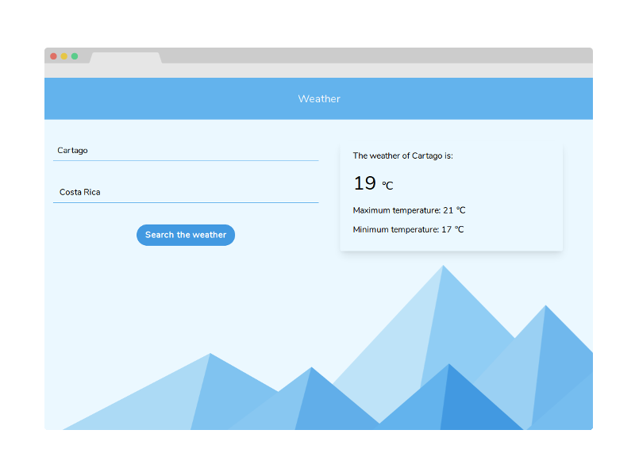

<div align="center">

# Weather

[Getting Started](#getting-started) | [Prerequisites](#prerequisites) | [Installation](#installation) | [Built With](#built-with)

</div>

<div align="center">
  
</div>

## Getting Started

Weather with Hooks and Open Weather Map API.

### Prerequisites

Install the [ESLint](https://github.com/Microsoft/vscode-eslint) extension if you use Visual Studio Code.

### Installation

**Step 1:** Clone or download the repo.

**Step 2:** Switch to your repository's directory.

```
cd /path/to/your/repo
```

**Step 3:** Install dependencies.

```
yarn install
```

**Step 4:** Duplicate the .env.example file and rename it to .env and change the environment variables.

```
cp .env.example .env
```

**Step 5:** Run the server.

```
yarn start
```

## Built With

- [React](https://reactjs.org/) - A JavaScript library for building user interfaces.
- [Tailwind CSS](https://tailwindcss.com/) - A utility-first CSS framework for rapidly building custom designs.
- [SVG Backgrounds](https://www.svgbackgrounds.com/) - Customize and apply backgrounds fast.
- [Open Weather Map](https://openweathermap.org/) - Get current weather, daily forecast for 16 days, and 3-hourly forecast 5 days for your city.

Made with ❤ by bryandms.
